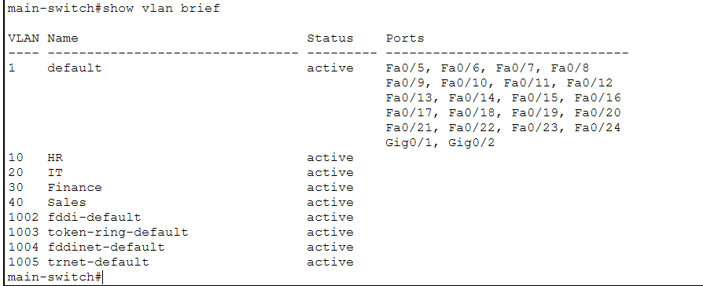
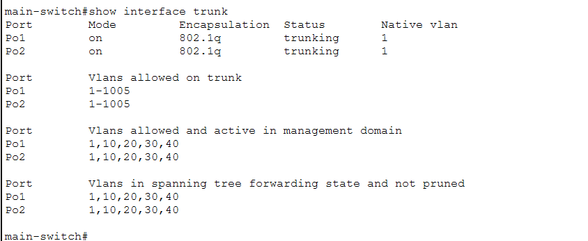
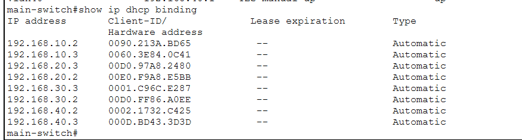
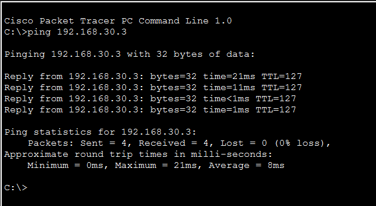
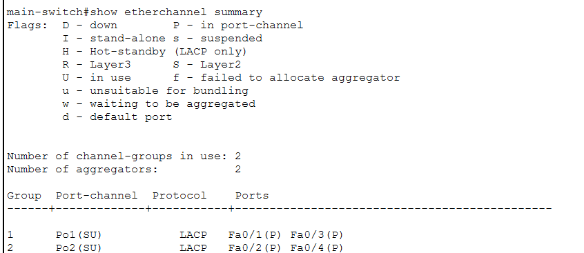
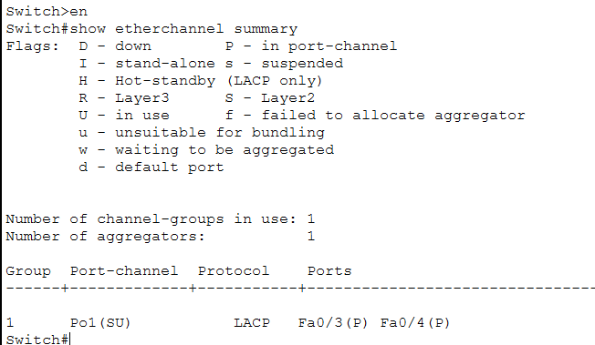
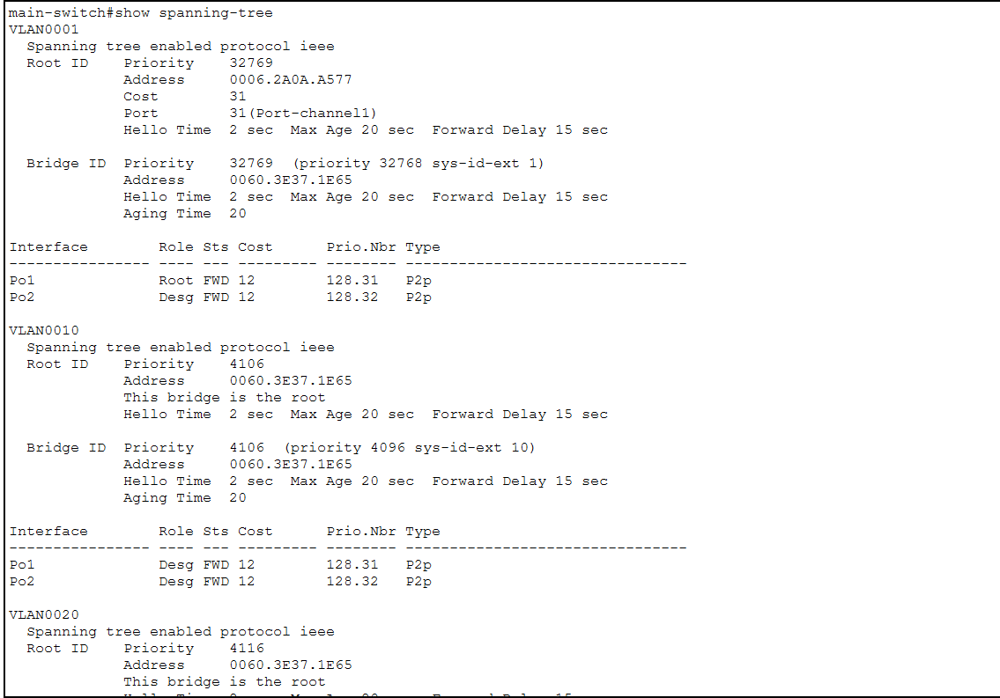
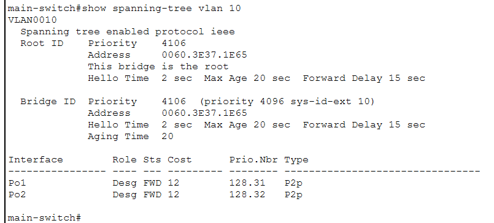
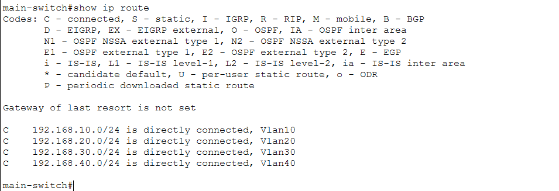
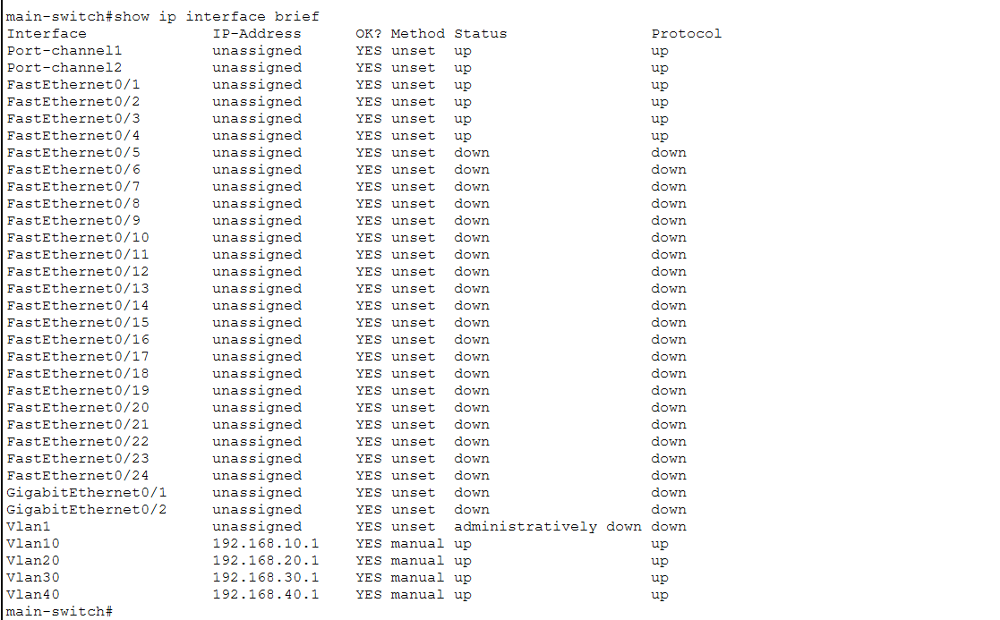

# Enterprise Campus Network with Layer 3 Switching

## Network Topology


## Project Overview
Designed and implemented a multi-floor enterprise campus network using Cisco Catalyst switches. The solution provides VLAN segmentation, centralized inter-VLAN routing, DHCP automation, EtherChannel redundancy, and Spanning Tree loop prevention.

## Business Scenario
A medium-sized enterprise occupies multiple office floors and requires secure departmental segmentation for HR, IT, Finance, and Sales while maintaining centralized management and high availability.

## Network Architecture

### Core Layer
- Cisco Catalyst 3560 Multilayer Switch
- Inter-VLAN Routing
- DHCP Services

### Distribution Layer
- First Floor Switch
- Second Floor Switch

### Access Layer
- HR Switch
- IT Switch
- Finance Switch
- Sales Switch

## VLAN Design

| VLAN | Department | Gateway |
|------|------------|----------|
| 10 | HR | 192.168.10.1 |
| 20 | IT | 192.168.20.1 |
| 30 | Finance | 192.168.30.1 |
| 40 | Sales | 192.168.40.1 |

## Technologies
- VLANs
- 802.1Q Trunking
- Layer 3 Switching
- DHCP
- EtherChannel (LACP)
- Spanning Tree Protocol (STP)

## Verification Screenshots

### VLAN Verification


### Trunk Verification


### DHCP Services


### EtherChannel Verification




### STP Verification


### Layer 3 Routing


### SVI Interfaces


### End-to-End Connectivity


## Folder Structure

```text
enterprise-campus-network-with-layer3-switching/
│
├── packet-tracer-file/
│   └── Enterprise-Campus-Network.pkt
│
├── screenshots/
│   ├── topology.png
│   ├── vlan-verification.png
│   ├── trunk-verification.png
│   ├── dhcp-bindings.png
│   ├── etherchannel-core.png
│   ├── etherchannel-floor1.png
│   ├── etherchannel-floor2.png
│   ├── stp-verification.png
│   ├── routing-table.png
│   ├── svi-verification.png
│   └── connectivity-test.png
│
└── README.md
```

## Key Achievements
- Built a segmented enterprise campus network.
- Implemented centralized Layer 3 inter-VLAN routing.
- Configured DHCP for automatic host provisioning.
- Deployed LACP EtherChannel for redundancy and bandwidth aggregation.
- Implemented STP to eliminate switching loops.
- Validated end-to-end inter-VLAN communication.

## Lessons Learned
- EtherChannel consistency is critical across all member interfaces.
- STP root bridge placement affects forwarding paths.
- DHCP failures are often caused by VLAN or trunk propagation issues.
- Layer 3 switching simplifies campus routing design.

## Author
Yashjeet Barak
